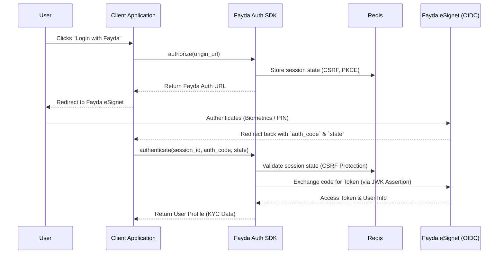

# Fayda Auth Python SDK

[](https://www.python.org/downloads/)
[](https://opensource.org/licenses/MIT)

`fayda-auth` is a robust Python library for integrating with the **Ethiopian National ID Program (Fayda)** via the eSignet OAuth 2.0 / OpenID Connect authentication provider. 

This SDK abstracts the complexities of the Fayda authentication flow, simplifying the process of generating secure authorization URLs, managing highly concurrent sessions with Redis, and authenticating users via token exchange and modern JWK-based client assertions.

---

## Architecture & Auth Flow



---

## Features

- **Standardized OAuth Flow**: Seamless integration with Fayda eSignet.
- **Secure State Management**: Redis-backed session management for CSRF protection and scalability.
- **Enterprise Security**: Built-in support for JWK (JSON Web Key) private key client assertions.
- **Framework Agnostic**: Easily integrates with Flask, Django, FastAPI, or any Python backend.

---

## Installation

Install `fayda-auth` directly from PyPI:

```bash
pip install fayda-auth
```

### Requirements
- Python 3.8+
- A running Redis server (for session state management)

---

## Quick Start

Here is a minimal example of how to implement the SDK in a standard Python application.

```python
from fayda_auth import FaydaAuth, HostConfig
import redis

# 1. Initialize Redis client (for session management)
redis_client = redis.Redis(host='localhost', port=6379, db=0)

# 2. Configure the SDK
auth = FaydaAuth(
    host_configs=[
        HostConfig(
            origin="http://localhost:3000", 
            redirect_uri="http://localhost:3000/callback"
        )
    ],
    redis_client=redis_client,
    env_file=".env"
)

# 3. Generate authorization URL (Redirect user here)
result = auth.authorize("http://localhost:3000")
print(result)

# 4. Authenticate User (Handle the callback)
auth_result = auth.authenticate(
    session_id=result["data"]["session_id"],
    auth_code="<auth_code_from_callback>",
    csrf_token=result["data"]["state"]
)
print(auth_result)
```

---

## Configuration (.env)

Create a `.env` file in your project root with your specific Fayda credentials:

```ini
# Redis Configuration
REDIS_HOST=localhost
REDIS_PORT=6379

# Fayda eSignet Credentials
FAYDA_OAUTH_CLIENT_ID=your_client_id
FAYDA_OAUTH_CLIENT_ASSERTION_TYPE=urn:ietf:params:oauth:client-assertion-type:jwt-bearer
FAYDA_OAUTH_PRIVATE_KEY=<base64_encoded_jwk_private_key>

# Fayda Endpoints
FAYDA_AUTHORIZE_URL=https://esignet.example.com/authorize
FAYDA_TOKEN_URL=https://esignet.example.com/v1/esignet/oauth/v2/token
FAYDA_USER_INFO_URL=https://esignet.example.com/v1/esignet/oidc/userinfo
```

> **Security Note:** `FAYDA_OAUTH_PRIVATE_KEY` must be a base64-encoded JWK (JSON Web Key) RSA private key. Keep this strictly confidential.

---

## Complete Flask Example

Below is a complete implementation using Flask to handle both the authorization redirect and the authentication callback.

```python
from flask import Flask, request, jsonify
from fayda_auth import FaydaAuth, HostConfig
import redis

app = Flask(__name__)
redis_client = redis.Redis(host='localhost', port=6379, db=0)

auth = FaydaAuth(
    host_configs=[HostConfig("http://localhost:3000", "http://localhost:3000/callback")],
    redis_client=redis_client,
    env_file=".env"
)

@app.route('/authorize', methods=['GET'])
def authorize():
    """Generates the Fayda Auth URL and returns it to the client."""
    origin = request.args.get('utm_source', 'http://localhost:3000')
    try:
        result = auth.authorize(origin)
        return jsonify(result), result['status_code']
    except Exception as e:
        return jsonify({"error_message": str(e), "status_code": 500}), 500

@app.route('/authenticate', methods=['POST'])
def authenticate():
    """Handles the Fayda callback, validating the session and retrieving user info."""
    data = request.get_json()
    try:
        result = auth.authenticate(
            session_id=data['session_id'],
            auth_code=data['auth_code'],
            csrf_token=data['csrf_token']
        )
        return jsonify(result), result['status_code']
    except Exception as e:
        return jsonify({"error_message": str(e), "status_code": 500}), 500

if __name__ == '__main__':
    app.run(host='0.0.0.0', port=5252)
```

### API Responses

**Expected `POST /authenticate` Response:**
```json
{
    "status_code": 200,
    "message": "Authentication successful",
    "data": {
        "sub": "2039482934",
        "name": "Abebe Kebede",
        "gender": "M",
        "birthdate": "1990-01-01",
        "phone": "+251911234567",
        "residenceStatus": "Citizen",
        "address": {
            "region": "Addis Ababa",
            "zone": "Addis Ababa",
            "woreda": "Woreda 01",
            "kebele": "02"
        },
        "picture": "base64_encoded_image..."
    }
}
```

---

## Development & Testing

Install development dependencies:
```bash
pip install -r requirements.txt
pip install pytest pytest-cov flake8 black
```

Run test suite with coverage:
```bash
pytest --cov=fayda_auth tests/
```

Format code:
```bash
black fayda_auth/
flake8 fayda_auth/
```

---

## Contributing

1. Fork the repository
2. Create a feature branch: `git checkout -b feature/your-feature`
3. Commit changes: `git commit -m "feat: Add your feature"`
4. Push to the branch: `git push origin feature/your-feature`
5. Open a Pull Request

---

## License

This project is licensed under the MIT License - see the [LICENSE](LICENSE) file for details.

---
## Developed By
**[Awura Computing PLC](https://awura.tech/)** | Addis Ababa, Ethiopia  
**Core Maintainer & Original Author:** Kidus Alemayehu
